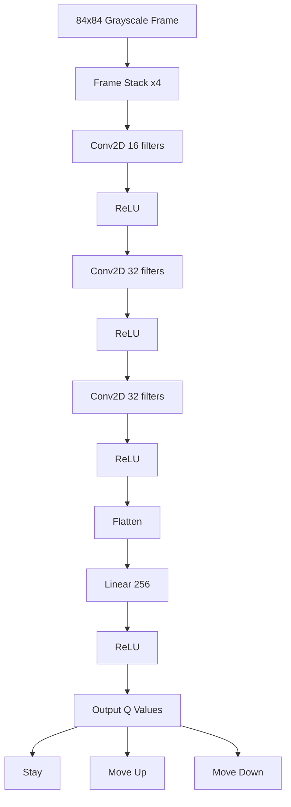
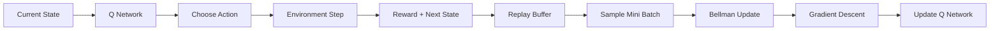

# 🏓 Pong RL — Deep Q-Network Agents in PyGame

A reinforcement learning implementation of Pong where **two Deep Q-Network (DQN) agents** learn to play against each other directly from pixels.

The project uses:

- Deep Q-Learning (DQN)
- PyGame environment
- Raw frame-based observations
- CNN-based Q-network
- Self-play training

Both paddles are controlled entirely by neural networks.

---

# Demo

## Training Mode

Agents:

- explore using ε-greedy policy
- collect transitions
- learn from replay buffer
- improve through self-play

## Evaluation Mode

Agents:

- use trained weights
- act greedily
- no exploration/random actions

---

# Features

- Real-time Pong simulation
- Deep Reinforcement Learning from pixels
- 84×84 grayscale preprocessing
- 4-frame temporal stacking
- CNN-based policy approximation
- Experience replay buffer
- Target network synchronization
- Live training statistics
- Save/load trained agents
- CPU-only compatible

---

# Project Structure

```text
RL_pong/
│
├── main.py
├── rl.py
├── entities.py
├── ui.py
├── config.py
│
├── agent_p1.pt
├── agent_p2.pt
│
├── README.md
└── requirements.txt


---

# File Breakdown

## `main.py`

Main application loop and simulation controller.

Handles:

* game loop
* rendering
* RL interaction
* reward shaping
* training/evaluation modes
* statistics
* collision handling
* frame capture

Core responsibilities:

```text
Environment
    ↓
Frame Capture
    ↓
Agent Action Selection
    ↓
Physics Update
    ↓
Reward Assignment
    ↓
Replay Buffer Storage
    ↓
Network Training
```

---

## `rl.py`

Contains all reinforcement learning logic.

Includes:

* CNN Q-network
* replay buffer
* frame preprocessing
* frame stacking
* DQN agent
* Bellman update
* epsilon-greedy exploration

Implements:

```text
state → Q-network → action
```

---

## `entities.py`

Contains game entities:

### Paddle

* movement
* bounds checking
* rendering

### Ball

* velocity
* collisions
* bouncing
* scoring logic

---

## `ui.py`

Reusable UI widgets.

Currently contains:

### Slider

Used for:

* FPS selection
* number of rounds
* paddle speed
* ball speed

---

## `config.py`

Global constants:

* screen dimensions
* colors
* game states
* UI sizing
* speed defaults

---

# Reinforcement Learning Pipeline

The agents learn directly from game frames.

---

## Observation Space

Each frame:

```text
Game Surface
    ↓
84×84 grayscale conversion
    ↓
Stack last 4 frames
```

Final state shape:

```text
(4, 84, 84)
```

This gives the network temporal awareness:

* ball direction
* velocity
* paddle movement

---

# Action Space

Each agent chooses one of:

| Action | Meaning   |
| ------ | --------- |
| 0      | Stay      |
| 1      | Move Up   |
| 2      | Move Down |

---

# Reward Function

Reward shaping:

| Event           | Reward |
| --------------- | ------ |
| Hit ball        | +1     |
| Opponent scores | +1     |
| Miss ball       | -1     |
| Neutral frame   | 0      |

This encourages:

* longer rallies
* defensive positioning
* accurate interception

---

# Deep Q-Network Architecture



---

# DQN Training Pipeline



---

# Experience Replay

Transitions are stored as:

```text
(state, action, reward, next_state, done)
```

Benefits:

* stabilizes learning
* breaks temporal correlations
* improves sample efficiency

---

# Target Network

Two networks are maintained:

| Network        | Purpose                |
| -------------- | ---------------------- |
| Online Network | actively trained       |
| Target Network | stable Bellman targets |

Target network updates periodically:

```text
online → target
```

This improves DQN stability.

---

# Epsilon-Greedy Exploration

Training uses ε-greedy exploration.

```text
ε = high  → random actions
ε = low   → learned policy
```

Epsilon decays gradually over time.

---

# Installation

## Recommended Environment

Use:

* Python 3.11
* CPU-only PyTorch

This avoids:

* CUDA instability
* Triton crashes
* torch.compile issues

---

# Setup

## 1. Create Virtual Environment

```bash
python3.11 -m venv venv
```

---

## 2. Activate Environment

### Linux / macOS

```bash
source venv/bin/activate
```

### Windows

```bash
venv\\Scripts\\activate
```

---

## 3. Install Dependencies

```bash
pip install pygame numpy
pip install torch --index-url https://download.pytorch.org/whl/cpu
```

---

# Running the Project

```bash
python main.py
```

---

# Controls

## Setup Screen

Use sliders to configure:

* number of rounds
* FPS
* paddle speed
* ball speed

Buttons:

| Button | Description           |
| ------ | --------------------- |
| Train  | train agents          |
| Eval   | evaluate saved models |


---

# Performance Notes

This project is designed for CPU execution.

Recommended:

| Setting         | Value    |
| --------------- | -------- |
| FPS             | 60–120   |
| Training Rounds | 100+     |
| Python          | 3.11     |
| Torch           | CPU-only |

---

