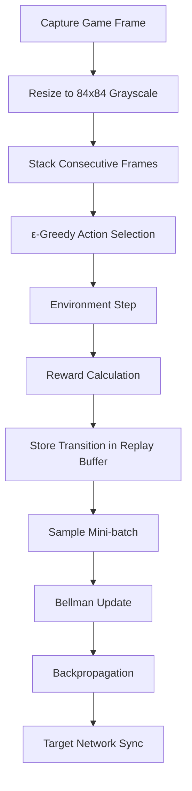
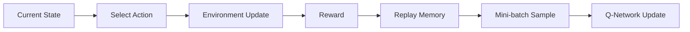
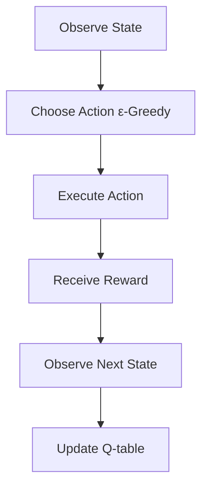

# Pong RL — Two Agents, Two Algorithms

A PyGame Pong environment where two reinforcement learning agents learn to play against each other from scratch.

The project contains **two complete implementations**:

* **Deep Q-Network (DQN)** — learns directly from pixels using a convolutional neural network
* **Tabular Q-Learning** — learns from a compact handcrafted state representation using a Q-table

This allows direct comparison between deep reinforcement learning and classical reinforcement learning in the same environment.

---

# Features

* Two independent RL implementations
* Real-time training visualization
* Reward shaping for stable learning
* Automatic model persistence
* Training and evaluation modes
* Interactive setup UI with sliders
* Side-by-side comparison of deep vs tabular RL

---

# Implementations

| Feature              | DQN (Deep Q-Network)   | Q-Learning (Tabular)               |
| -------------------- | ---------------------- | ---------------------------------- |
| Directory            | `DQN/`                 | `Qlearning/`                       |
| Observation Space    | 84×84 grayscale frames | Relative ball position + direction |
| Model                | CNN                    | Q-table                            |
| State Representation | Raw pixels             | Handcrafted discrete states        |
| Framework            | PyTorch                | NumPy                              |
| Saved Weights        | `.pt`                  | `.pkl`                             |
| Decision Frequency   | Every frame            | Periodic decisions                 |

---

# Project Structure

```text
RL_pong/
│
├── config.py
├── entities.py
├── ui.py
│
├── DQN/
│   ├── main.py
│   ├── rl.py
│   ├── agent_p1.pt
│   └── agent_p2.pt
│
├── Qlearning/
│   ├── main.py
│   ├── rl.py
│   ├── agent_p1.pkl
│   └── agent_p2.pkl
│
└── README.md
```

---

# Installation

Python 3.11 is recommended.

## Create Virtual Environment

```bash
python3.11 -m venv venv
source venv/bin/activate
```

Windows:

```bash
venv\Scripts\activate
```

---

# Dependencies

## Q-Learning Version

```bash
pip install pygame numpy
```

## DQN Version

```bash
pip install pygame numpy
pip install torch --index-url https://download.pytorch.org/whl/cpu
```

---

# Running the Project

## Deep Q-Network

```bash
python DQN/main.py
```

## Tabular Q-Learning

```bash
python Qlearning/main.py
```

Both launchers open the same setup screen where you can configure:

* Number of rounds
* Ball speed
* Paddle speed
* Training or evaluation mode

---

# Deep Q-Network (DQN)

The DQN implementation learns directly from rendered game frames without manually engineered features.

Each frame is:

1. Converted to grayscale
2. Downscaled to `84×84`
3. Stacked with previous frames

This gives the network temporal information such as velocity and direction.

---

## DQN Pipeline



---

# CNN Architecture

```text
Input: 6 × 84 × 84 stacked frames

Conv2d(6 → 16, kernel=8, stride=4)
ReLU

Conv2d(16 → 32, kernel=4, stride=2)
ReLU

Conv2d(32 → 32, kernel=3, stride=1)
ReLU

Flatten

Linear(1568 → 256)
ReLU

Linear(256 → 2)
```

Output actions:

* Move Up
* Move Down

---

# DQN Training Flow



---

# DQN Hyperparameters

| Parameter             | Value           |
| --------------------- | --------------- |
| Discount Factor (`γ`) | `0.995`         |
| Learning Rate         | `1e-4`          |
| Replay Buffer Size    | `50,000`        |
| Batch Size            | `64`            |
| Target Sync Interval  | `1000`          |
| Exploration Decay     | `100,000` steps |

---

# Tabular Q-Learning

The tabular implementation uses a compact handcrafted state space.

Instead of learning from pixels, the agent observes:

* Relative ball position
* Whether the ball is approaching

This produces a very small and efficient state representation.

---

# State Representation

```text
Relative Ball Y Position  → 16 buckets
Ball Moving Toward Agent → 2 states

Total States:
16 × 2 = 32
```

Each state contains Q-values for:

* Move Up
* Move Down
* Stay

Result:

```text
32 states × 3 actions = 96 Q-values
```

---

# Q-Learning Decision Loop



---

# Bellman Update Equation

```text
Q(s, a) ← Q(s, a) + α [ r + γ max Q(s', a') − Q(s, a) ]
```

Where:

| Symbol | Meaning          |
| ------ | ---------------- |
| `α`    | Learning rate    |
| `γ`    | Discount factor  |
| `r`    | Immediate reward |
| `s'`   | Next state       |

---

# Reward Shaping

Both implementations use identical reward shaping.

| Event                     | Reward               |
| ------------------------- | -------------------- |
| Ball hits paddle          | `+1.0 + rally_bonus` |
| Opponent misses           | `+2.0`               |
| Agent misses              | `−2.0`               |
| Staying aligned with ball | `+0.00 → +0.05`      |
| Hugging screen boundaries | `−0.02`              |

The rally bonus increases with consecutive hits, encouraging sustained rallies instead of random scoring.

---

# Sidebar Statistics

## DQN Statistics

* Current epsilon (`ε`)
* Average loss
* Total training steps

## Q-Learning Statistics

* Current epsilon (`ε`)
* Current alpha (`α`)
* Average TD error
* Q-table size
* Total decision steps

---

# Modes

## Train Mode

* Loads existing weights if available
* Continues learning
* Uses ε-greedy exploration
* Automatically saves learned parameters

## Evaluation Mode

* Loads saved weights/tables
* Disables exploration
* Runs fully greedy policy
* Falls back to random actions if no saved model exists

---

# Comparing the Approaches

## Deep Q-Network

Advantages:

* Learns directly from pixels
* No handcrafted features
* More generalizable

Disadvantages:

* Slower convergence
* Higher computational cost
* Requires PyTorch

---

## Tabular Q-Learning

Advantages:

* Extremely lightweight
* Fast convergence
* Easy to interpret

Disadvantages:

* Limited state representation
* Cannot generalize beyond designed states
* Less scalable


---

# Dependencies Summary

| Package  | DQN | Q-Learning |
| -------- | --- | ---------- |
| `pygame` | ✓   | ✓          |
| `numpy`  | ✓   | ✓          |
| `torch`  | ✓   | —          |

---


# License

This project is intended for educational and research purposes.
